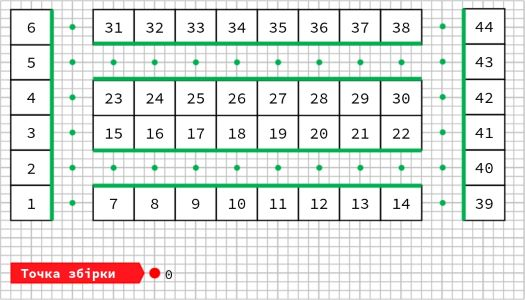

# Hack4Retail round 2

"Tsina Tyzhnia" team solution for the final round of Hack4Retail Hackathon.

Achieved 1st place on the private leaderboard and 4th on the public.

## Task

**Optimize darkstore items placing**

_1 big cell = 4 small cells = 2 m_

#### Darkstore layout

The layout of the racks in the darkstore: six 3-tier racks, each rack is divided into sections, which are numbered with the numbers 1,2, ..., 44. Each section has 3 levels. Thus, there are a total of 132 cells. Only one item can be stored in each cell

#### Movement speed

The movement speed between racks is 1 m/s. Time required for pick-up of any goods from levels 1, 2, 3 makes 1 s, 2 s, 3 s respectively.

#### Route

We assume that when forming each order, the picker knows the shortest route from section to section. The collection of the cheque begins and ends at the assembly point marked with the number 0.
You can pick up goods from the shelves only from the green dots on the side of the green lines.
We assume that the picker can move only on cells and, thus, the passed way is measured in city-block distance.

#### Given data

Orders / cheques of another, similar, darkstore for the last month.

#### Miscellaneous

We assume that the items in the cell never end.

## Approach

### Validation

At first, we created a function that computes travel and picking time for the given set of cheques: for each cheque, it computes picking time by multiplying level pick-up time and amount of items that should be picked, and the travel time by moving to the nearest section from cheque each turn. Sections and levels are taken from the current darkstore map.

Actually, our function somewhat differs from the one used on the leaderboard - it sometimes returns a higher time for some of the cheques. But on average it still correlated with LB, so we decide to keep it. 

_For travel time computing we used a distance matrix of the darkstore - we created it by hands, but in general, it should be created from the given layout with some algorithms like bfs_.

### Baseline

We sorted (section, level) pairs by the distance from section to the entry point and sorted items by the number of appears in the dataset, then concat into a single dataframe.

### Ranging

The basis of our solution was two-step ranging by the linear combination of items features:

1. Extract features from the historical data: total number of sales, the average amount in a cheque, and the average number of unique items in cheques containing this item. Create polynomial features based on them
2. Create two linear combinations of these features.
3. Use the first linear combination to determine the level for each item: sort them by the received metric and assume the first 1/3 should be placed on 1st level, second 1/3 on 2nd level, and the last 1/3 on 3rd level.
4. For each group: sort sections by distance from the entry point and fill them with items starting with one with the highest value of the second linear combination.
5. Fit linear combination coefficients with Optuna to minimize total pick-up time.

### Genetic Algorithms

Our final solution was found by the genetic algorithms, using placing we received with ranging as a starting point.

### Other

We also tried to use the Apriori algorithm to find relations between different items, and the clustering of items by embeddings built with Word2Vec-like approaches, but it didn't work in this task, probably because of a small amount of data.

## Notebooks & Files

- `Validation & notes.ipynb` - validation scheme, approaches scoring, and some other experiments
ating a ranging by features with Optuna

- `Fine-tuning with Genetic.ipynb` - creating the final submission

- `input/`
  - `cheques_public.csv` - historical data given by organizers
  - `darkstore_map.csv` - sample submission
  - `darkstore.csv` - darkstore distance matrix, created by us

- `submissions/` - this folder contains both of our submissions and their results given by organizers
  - `validation_submission/` - our baseline
  - `final_submission/` - ranging + genetic alghorithms
- `optuna-linear-ranging.ipynb` - creating a ranging by features with Optuna

- `Fine-tuning with Genetic.ipynb` - creating the final submission

- `input/`
  - `cheques_public.csv` - historical data given by organizers
  - `darkstore_map.csv` - sample submission
  - `darkstore.csv` - darkstore distance matrix, created by us

- `submissions/` - this folder contains both of our submissions and their results given by organizers
  - `validation_submission/` - our baseline
  - `final_submission/` - ranging + genetic alghorithms
